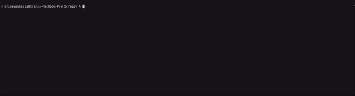

# Scrappy

<p align="center">
  <br /><br />
  <strong>Scrappy is a command line tool that will convert any website that can be scraped into a markdown.</strong><br /><br />
</p>

<p align="center">
  <a href="https://github.com/KrinsKumar/Scrappy">
    
  </a>
  <a href="https://github.com/KrinsKumar/Scrappy/graphs/contributors">
    
  </a>
  <a href="https://opensource.org/licenses/MIT">
    
  </a>
  <a href="https://github.com/KrinsKumar/Scrappy/issues">
    
  </a>
</p>

## How to use scrappy



1. Download the repo.
2. Run the following commands with the updated path variable that points to the location of the repo, run with `sudo` if there is a permission issue.

```
npm i
chmod +x /<PATH>/Scrappy/src/args/command.js
ln -s /<PATH>/Scrappy/src/args/command.js /usr/local/bin/scrappy
```

3. You will need [groq](https://console.groq.com/) API key to convert from page to md. Once you obtain you key, run the following command to update the key in you system.

```
scrappy --api-key <YOUR_API_KEY>
or
scrappy --a <YOUR_API_KEY>
```

## Features

- **Input**: The main feature is that you can convert any website into a md, For this we will need a url of the page. You can provide a URL either using a file or command line arg.

  1. **URL using a file (default)**: Add the url in the file and pass the file location onto the command line. The file should contain one line that has the url of the page that you want to scrap.

  ```
  scrappy files/input.txt
  ```

  2. **URL using command line arg**: Pass the url using the `-url` flag.

  ```
  scrappy --url https://www.senecapolytechnic.ca/cgi-bin/subject?s1=OSD600
  or
  scrappy -u https://www.senecapolytechnic.ca/cgi-bin/subject?s1=OSD600
  ```

- **Output**: The convert md can be stored in a preferred file if the file is passed using `-0` flag.

  1. **If the file is passed**: The final md will be stored in the output.md file in the files folder.

  ```
  scrappy files/input.txt -0 files/
  or
  scrappy files/input.txt --output files/output
  ```

  2. **The md is stored in the input file (default)**: A new md file will be created in the same folder of the input file with the updated md. In this case, a new file will be created `input.txt.md` in the same folder as the input.txt.

  ```
  scrappy files/input.txt
  ```

  - **Token Usage**: When the program is run with the --token-usage/-t flag set, extra information will be reported to stderr about the number of tokens that were sent in the prompt and returned in the completion.
    `scrappy files/input.txt --output files/output -t`

## Contributing

We welcome contributions to improve **Repo Insights**. If you have suggestions, bug reports, or enhancements, please open an issue or submit a pull request.

1. Fork the repository.
2. Create a feature branch (`git checkout -b feature/your-feature`).
3. Commit your changes (`git commit -am 'Add new feature'`).
4. Push to the branch (`git push origin feature/your-feature`).
5. Create a new Pull Request.

## License

This project is licensed under the MIT License - see the [LICENSE](LICENSE) file for details.
